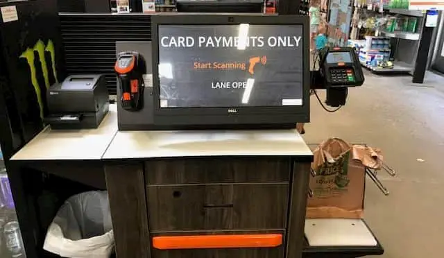
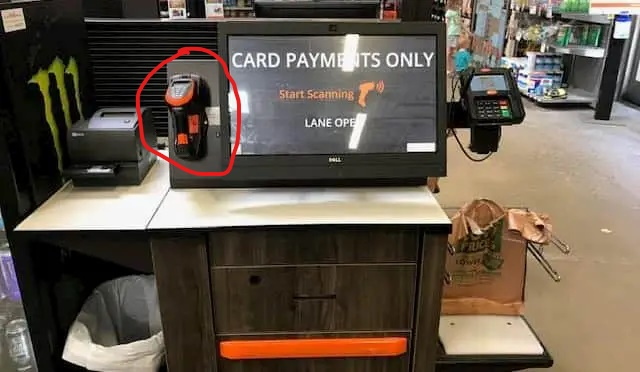

# UX Journal 1 - Home Depot Self Checkout Experience

## Eric Schieber Jr, 03/07/2021

One thing I appreciate about this class is that it has put me on to the complex world of usability. Everywhere I go, I am now thinking about everything I interact with and how it could be improved. Along with this, I have also been thinking about how myself as a user fits into the world of usability. Recently I had an experience with the self checkout system at Home Depot that I feel like would be applicable for this journal entry.

Funny story: I recently made a hole in my wall due to being drunk and reckless. The next day, I had to go to Home Depot to pick up a wall patching repair kit to patch the hole. After picking up my kit in the paint aisle, I went to the self checkout area to make my purchase. The self checkout I experienced looked identical to the one in the picture below. Please note that the picture I have provided is **not** my picture.

Immediately from the beginning, I was impressed with the UI of the self checkout. The scene was super sleek. The UI of the software running was also very impressive. I started by clicking the start button on the touch screen. The machine then prompted me to scan my items. I noticed that I had the option to scan my item with the scan gun circled in red. I must say, when using the scan gun, it was very **satisfying** to use. The trigger on the gun had great feedback along with a bright light that would help you see where you were exactly scanning the gun. I scanned my kit and placed it in the bagging area. I then remembered that I had store credit for Home Depot from a return that I made about six months back. I began the steps to pay for my kit. When prompted, I chose to use store credit. It then asked for me to scan the bar code on the back of the card. In this case, I then used the scan gun to scan the bar code. Unfortunately, after scanning the store credit, I was prompted with an error banner that let me know the card balance was $0.00. I understood and began the process to pay with a credit card. After paying, I grabbed my receipt and my repair kit, and my experience was over.

The immediate takeaway from this experience was how **efficient** the entire transaction was. When walking into the store, I happened to walk by the checkout area next to the lumber section. I could see that there were many people in line all with big carts of lumber and other hardware materials. Rather than waiting to be checked out in that line, I completed the transaction by myself. Regarding the **error tolerance** of the machine, I feel like the machine notifies users of errors in a very discreet way. Rather than making a noise or taking over the screen, the error shows up as a small banner notification in red. I liked this as it made me feel like I wasn't being yelled at for messing up.

I think that the Home Depot self checkout machine was very **useful** and **effective** in achieving my intended goal of purchasing my drywall repair kit. The machine allowed me to make my purchase very quickly with no need to have a worker help me with the process.
